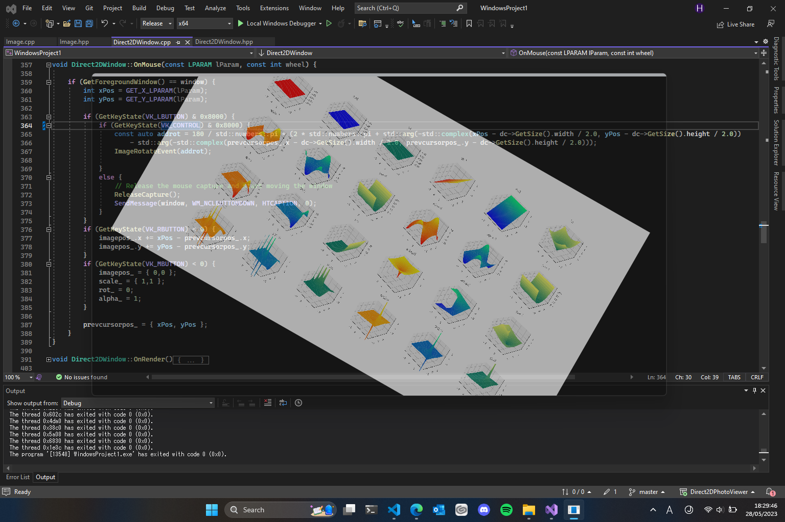

# Direct2DPhotoViewer

C++/WindowsAPI/Direct2Dの勉強として、操作のシンプルさを目指したフォトビューアを制作中です。

このフォトビューアは画像の移動・サイズ変更・回転・反転といった最低限の要素を残しつつ、  
ウィンドウの移動・サイズ変更・透過・複製・最前面への常時配置・マウスイベント無効などがキーボード上で可能です。

Visual Studioでインストールできるライブラリ以外の使用は禁止という縛りの基で作成。

--- 

## キーボード
|キー|説明|実装状況|
|--|--|--|
|WS|画像の拡大・縮小|✅|
|AD|画像を回転|✅|
|Q|画像の左右反転|✅|
|E|画像の上下反転|✅|
||||
|Ctrl+WSAD|画像の移動|✅|
|Ctrl+QE|ウィンドウの透明度を変更|✅|
||||
|↑↓←→|ウィンドウの移動|✅|
|Ctrl+↑↓←→|ウィンドウサイズの変更|✅|
||||
|F|別の画像を開く|✅|
|Ctrl+F|新しいウィンドウで画像を開く|✅|
|N|ビューアの複製|✅|
|B|背景の変更（黒→白→透明→...のループ）|✅|
|L|描画方法の変更（線形・ニアレストネイバー）|✅|
|T|最前面への配置の有効・無効切り替え|✅|
|Ctrl+F12|マウスイベントの透過|✅|
|(未定)|簡易的な色調整|📝|
||||
|?|操作ヘルプ|📝|
|Esc(長押し)|ウィンドウを閉じる|✅|

~~Shift同時押しで値変更の調整スピードが上がる~~（未実装）

---
## マウス
|操作|説明|実装状況|
|--|--|--|
|左ドラッグ|ウィンドウの移動|✅|
|右ドラッグ|画像の移動|✅|
|Ctrl+左ドラッグ|画像のサイズ変更|✅|
|中央クリック|画像の移動・サイズ・回転リセット|✅|
|ホイール回転|画像のサイズ変更|✅|

---
## TODO
|内容|実装状況|
|--|--|
|ソースコードを綺麗に纏める|🔄️（随時）|
|ソースコードを最適化|🔄️|
|読込失敗時の例外処理追加|🔄️|
|透過部分はウィンドウイベントを透過|❌（操作不能の可能性・高負荷な処理）|

---
### マーク
|アイコン|説明|
|--|--|
|✅|済み|
|🔄️|更新中|
|⚠️|問題あり（停滞中）|
|⚡|バグ発見|
|❌|廃案|
|📝|追加予定|

---
## 参考
Microsoft Learn: https://learn.microsoft.com/ja-jp/windows/win32/Direct2D/direct2d-overview
